

# W3 Companion: downloads

W3 Companion is a Warcraft III companion app: build orders floating over the
game with a clock that follows the game, private builds made by hand or from a
replay, opponent scouting, game reports, your own stats and achievements, and
a live observer HUD for casters and streamers.

This repository only hosts the installers and the app's update files. There is
no code here.

## Download the latest version
- Windows installer: [W3-Companion-Setup.exe](https://github.com/degrand91/w3-companion-releases/releases/latest/download/W3-Companion-Setup.exe)
- Windows portable (no install): [W3-Companion-Portable.exe](https://github.com/degrand91/w3-companion-releases/releases/latest/download/W3-Companion-Portable.exe)
- macOS: not available in the latest versions for now (the last one is on
  [Releases](https://github.com/degrand91/w3-companion-releases/releases)).

All versions: [Releases](https://github.com/degrand91/w3-companion-releases/releases).

The app is not code-signed yet: on Windows choose **More info, Run anyway**; on
macOS right-click the app and choose **Open** the first time. Installed copies
update themselves.

Warcraft III must run in windowed or borderless mode for the overlay to show.

## What it does
- **Build orders over the game:** a small panel with your build's steps and a
  timer that follows the game clock, with global shortcuts that work while the
  game has focus.
- **Private builds:** write them step by step, or make one from a replay or a
  W3Champions match.
- **Opponent card:** your opponent's recent form, records and openers when a
  game starts.
- **Game reports:** what cost a game, with numbers and tips, for any replay or
  W3Champions match, from either player's side.
- **Profile:** strengths and things to work on, judged on enough games to be
  more than luck, plus Warcraft-themed achievements.
- **Observer HUD** (Windows): live panels for observed games and replays, on
  your screen or as OBS browser sources: presets from a pro top bar to a clean
  strip, W3Champions player cards, kills and items logs, an end-of-match recap
  and a fight recap for every fight. It only shows observer data: never
  anything the game hides from a player in their own game.

## Build orders over the game

Your build's steps with their times and food, next to the game, with a timer
that follows the game clock.

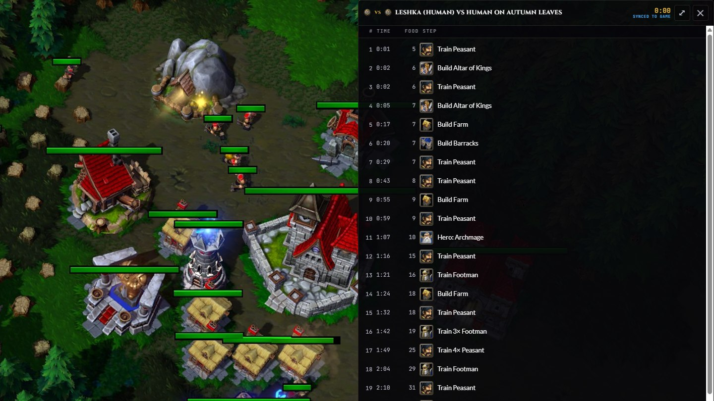

**Builds**: your private builds, filtered by race and matchup; make one by
hand, or from a replay or a W3Champions match.

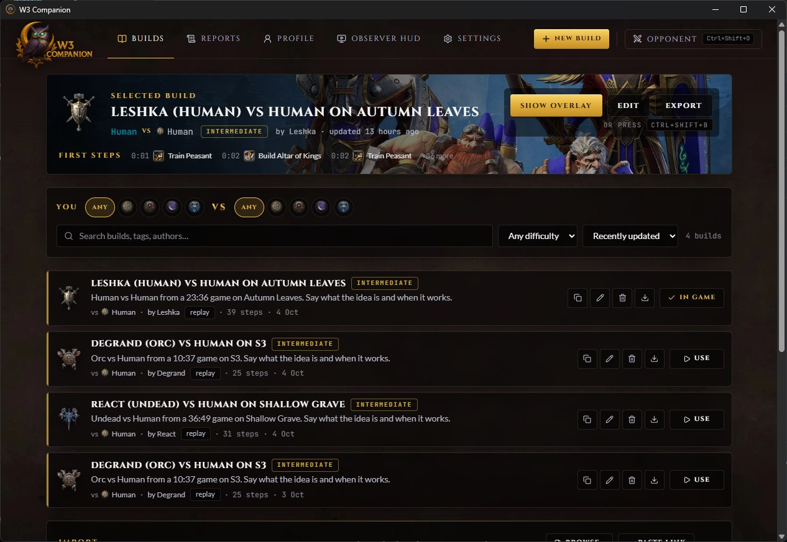

## Game reports

Any W3Champions match or replay on your computer, from either player's side.

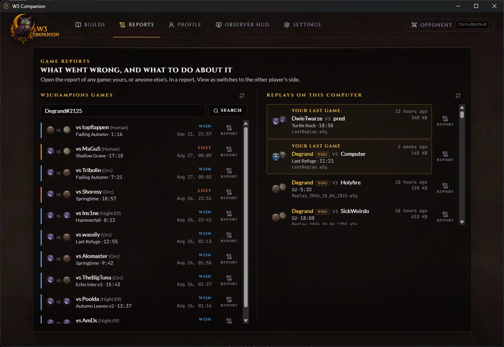

A report says what cost the game, with the numbers and a tip for each, and
compares you with your opponent.

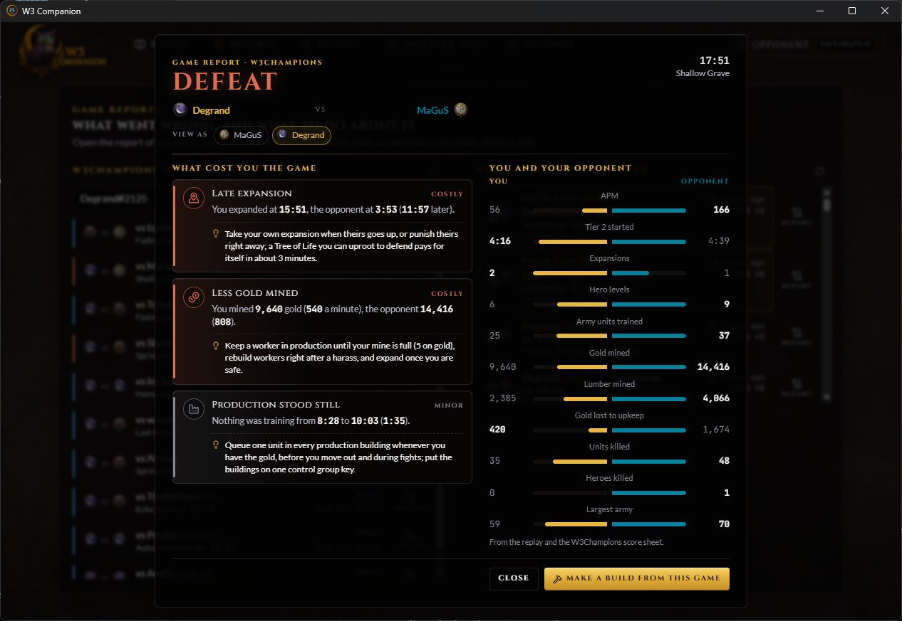

## Profile and achievements

Strengths and things to work on from your recent games, judged against what
your rating predicts, with your matchups and maps.

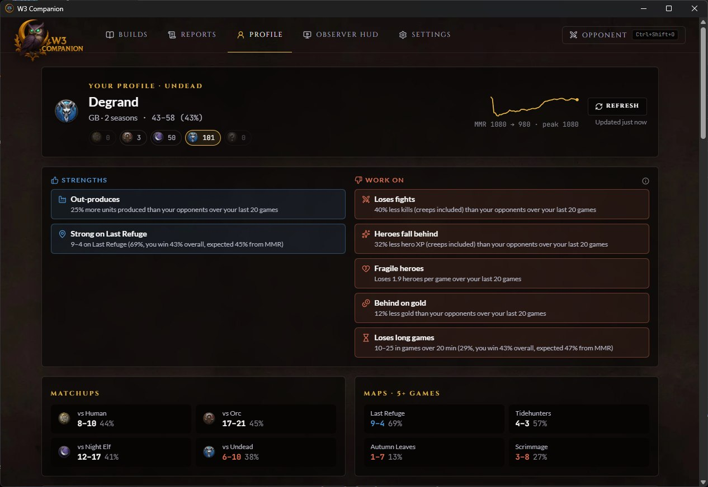

Warcraft-themed achievements, unlocked from your match history and every game
you play, each dated when it happened.

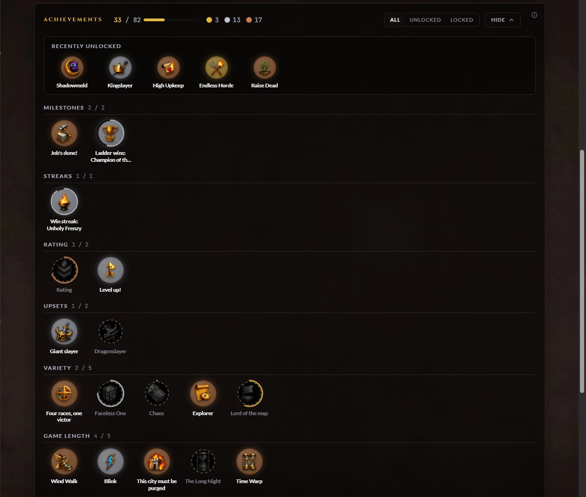

## Observer HUD

**In the app**: pick a preset, arrange the panels, set the series score and
players, and show the HUD on your screen or add it to OBS in one click.

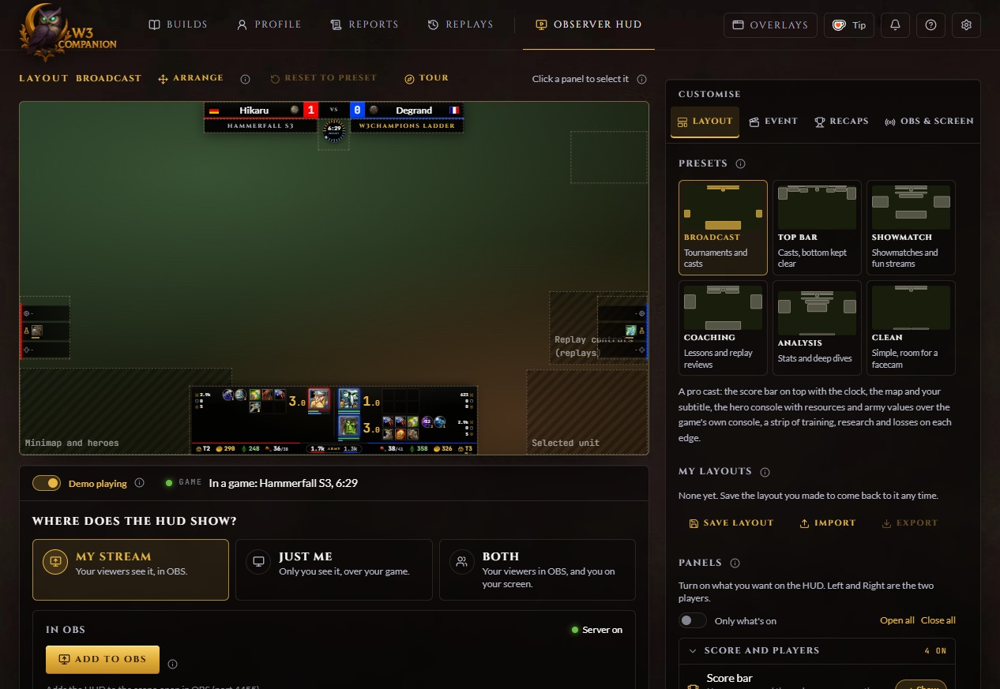

**Broadcast**: score bar, hero console over the game's bottom panel, and edge
strips with what each player is training, researching and has lost.

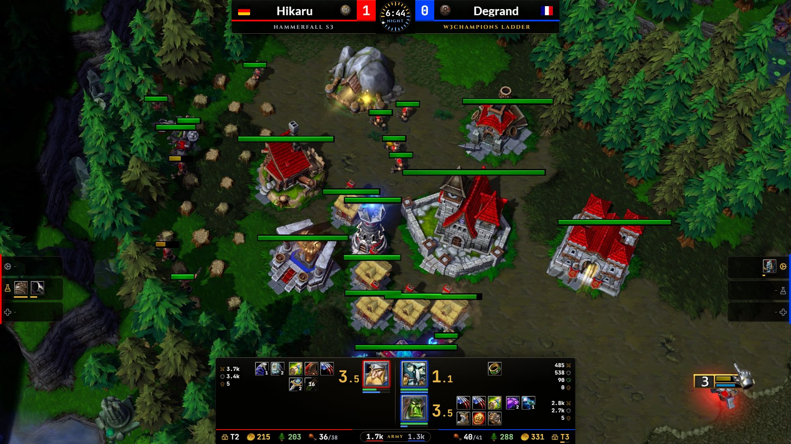

**Clean**: just the score bar and a slim resources strip, for an uncluttered
stream.

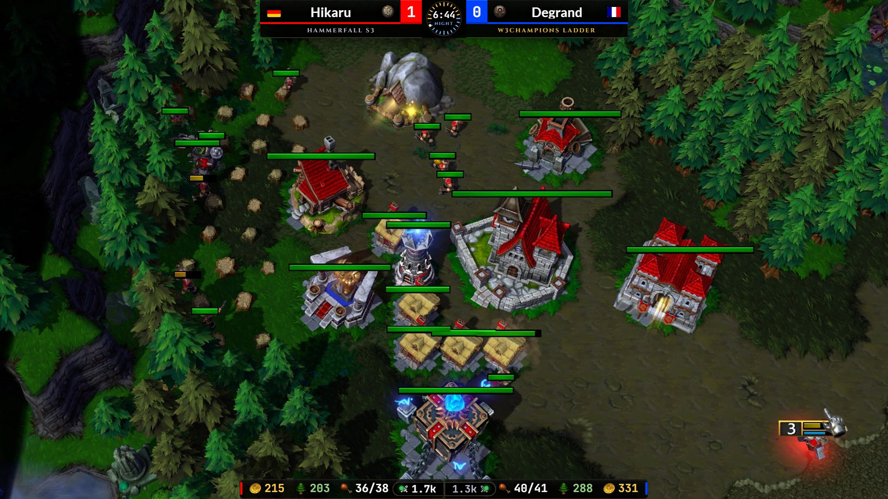

**Analyst**: Broadcast with fuller side columns, for replay reviews and
coaching.

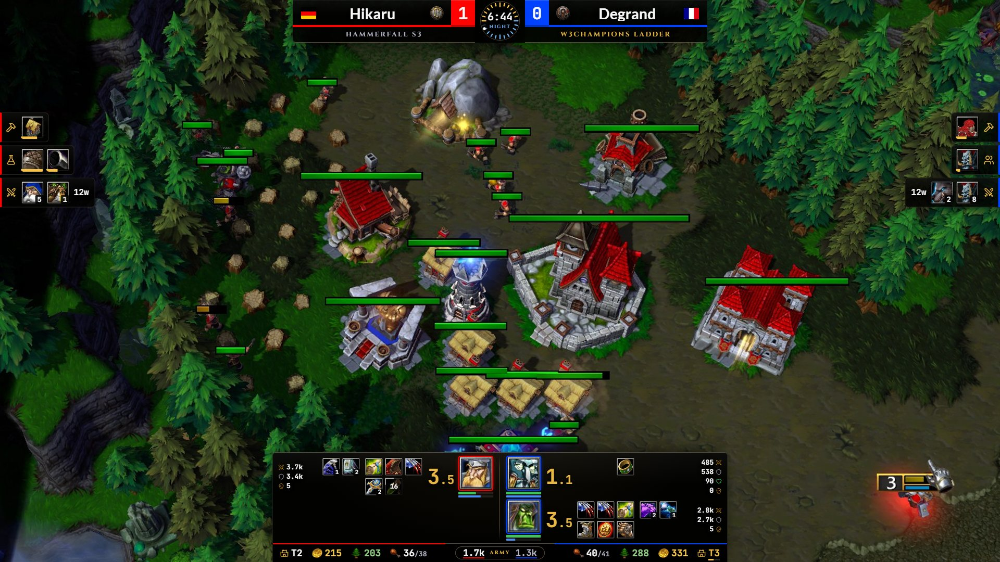

**Top bar**: everything along the top, as pro casts lay it out: resources on
the top edge with the score bar between them, hero cards with inventory,
spells and damage in each corner, the army and what is training beside them.
The game's own bottom panel stays clear.

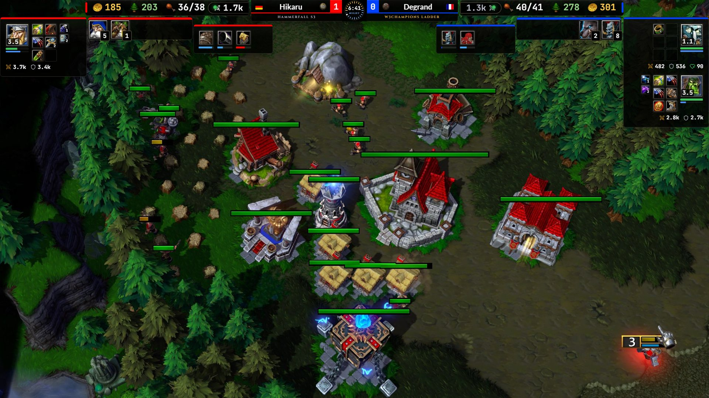

**Player cards**: to present the players, from their W3Champions ladder games:
rating and rank, record and form, how they do against this race, on this map
and against this opponent, the heroes they open with and how long their games
last.

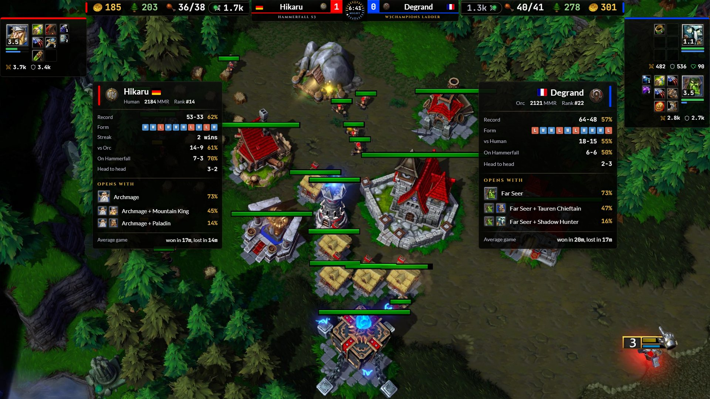

**Match stats**: units alive and lost per player, the resource difference
between the players, a kills log (who killed what, creeps included) and an
items log (who bought, got, sold or used what).

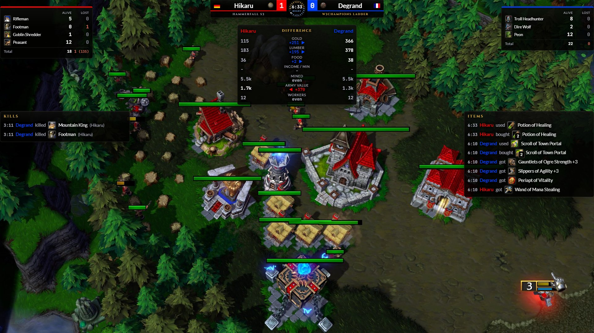

On your screen, hover any icon for its details (a hero's hit points, mana,
experience and damage, a spell's cooldown, an item's charges), and the cursor
stays visible over the panels.

**End-of-match recap**: hero performance, value generated and spent, losses,
items used and the value advantage over time.

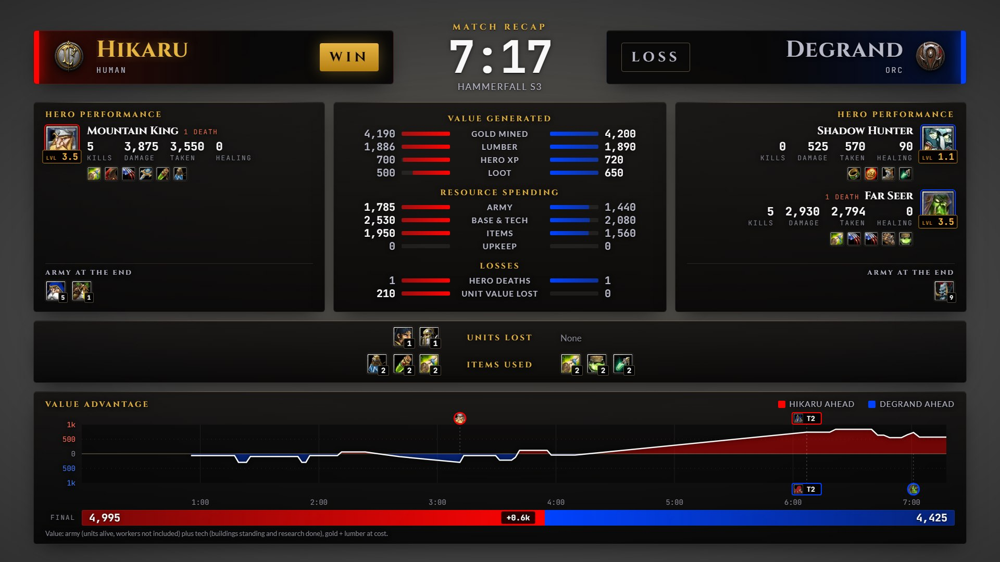

**Fight recap**: after each fight, the Notifications panel on your screen
lights up; one click shows the recap, on screen and in OBS: what each side
lost and used, each hero's damage dealt, taken and healed, and how the fight's
value swung.

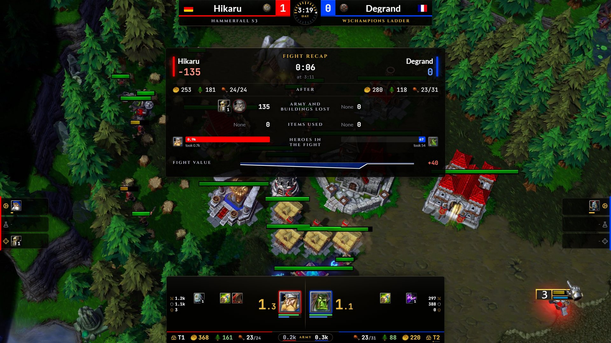

HUD screenshots: the app's demo recording over a Warcraft III replay. App
screenshots: the real app with a real W3Champions account.
